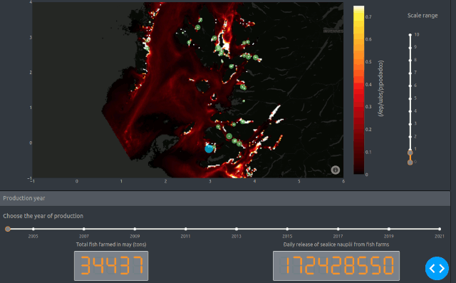

# FarmedLiceWestCoast
A plotly app to analyse sea lice infestation from fish farms on the West-Coast of Scotland.
The app allows you to modify a number of parameters to examine different scenarios.
The app allows you to go through several years of production and will consider the biomass of the farms that are active at the time.

